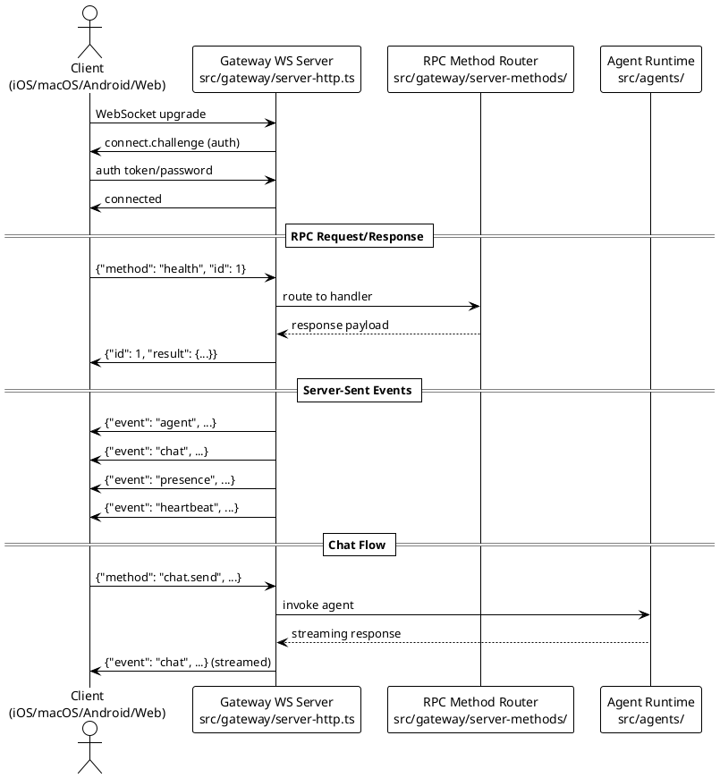
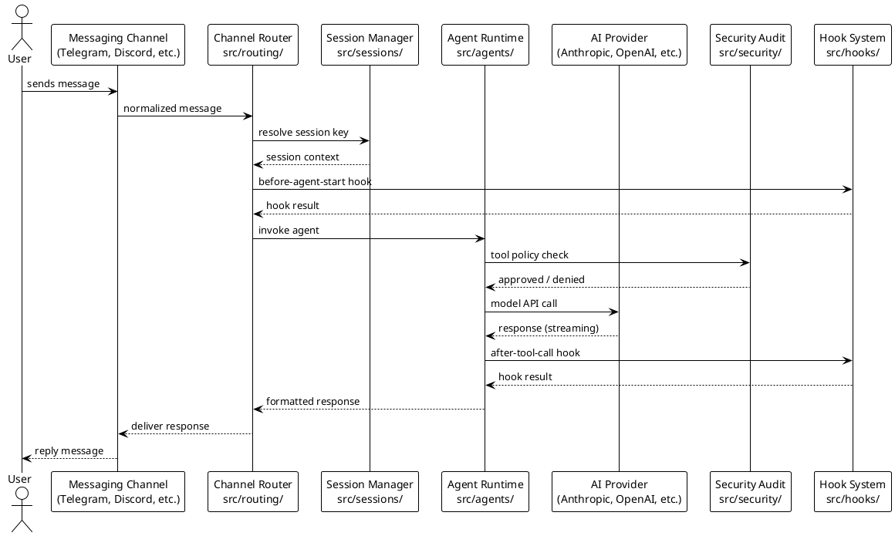
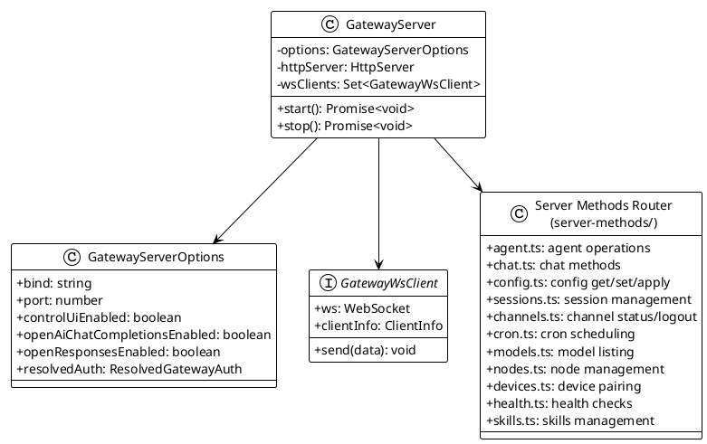
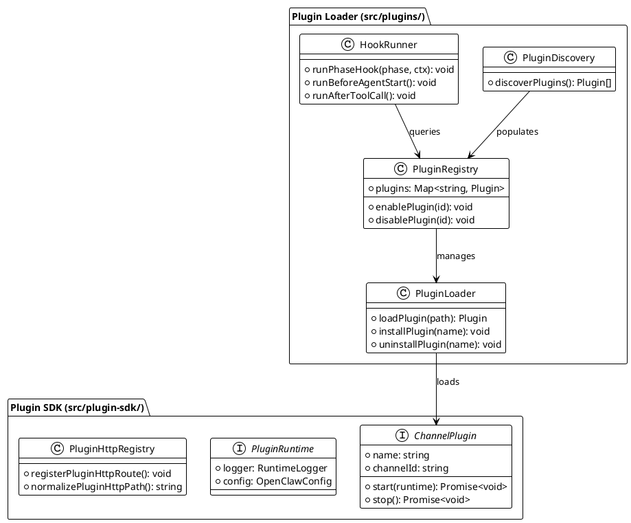
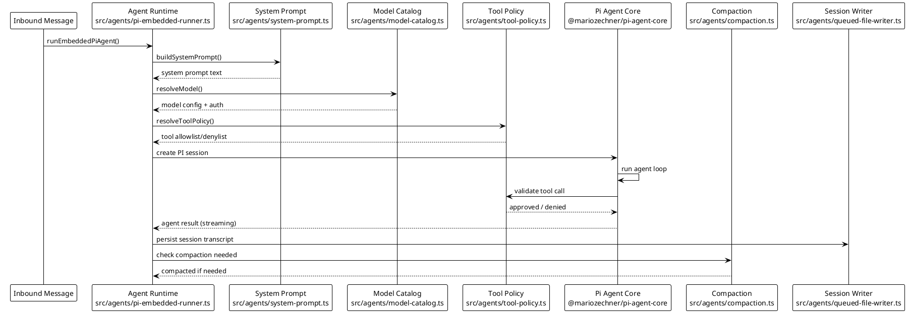
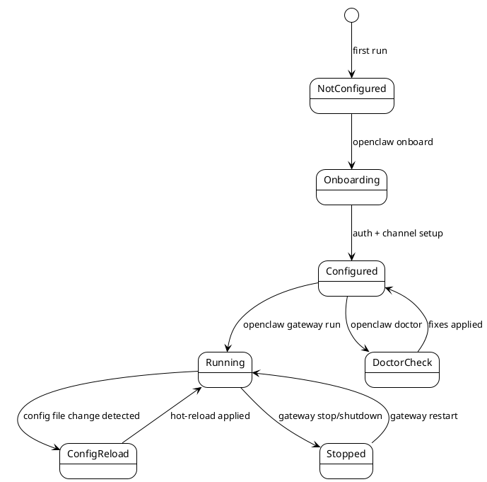

# OpenClaw — Architecture & Design Document

## 1. Document Control

| Field   | Value                         |
| ------- | ----------------------------- |
| Version | 1.0                           |
| Date    | 2026-02-17                    |
| Author  | AI Architect (auto-generated) |
| Status  | Draft                         |

---

## 2. System Overview

**OpenClaw** is a personal AI assistant that operates as a **multi-channel AI gateway**. It runs on the user's own devices and bridges AI model providers (Anthropic Claude, OpenAI GPT, Google Gemini, AWS Bedrock, GitHub Copilot, and more) with messaging channels the user already uses — WhatsApp, Telegram, Slack, Discord, Google Chat, Signal, iMessage, Microsoft Teams, IRC, Matrix, and others.

### Key Stakeholders

| Stakeholder       | Role                                                     |
| ----------------- | -------------------------------------------------------- |
| End Users         | Interact with AI via messaging channels and native apps  |
| Self-hosters      | Deploy and manage their own OpenClaw gateway instances   |
| Plugin Developers | Build extension channels and features via the Plugin SDK |
| Maintainers       | Core contributors maintaining the gateway, CLI, and apps |

### Deployment Topology

OpenClaw supports multiple deployment modes:

1. **Local (desktop)** — macOS menubar app, CLI process, or daemon
2. **Server** — Docker container on cloud VMs (Fly.io, Render, VPS)
3. **Mobile clients** — iOS and Android apps connecting to a gateway via WebSocket RPC
4. **Node mesh** — Multiple nodes paired to a single gateway for distributed agent execution

---

## 3. Component Diagram

```plantuml
@startuml HLD_Component_Diagram
!theme plain
skinparam componentStyle rectangle

package "OpenClaw Core" {
  [CLI Entry\nopenclaw.mjs → src/entry.ts] as CLI
  [Gateway Server\nsrc/gateway/server.impl.ts] as GW
  [Channel Router\nsrc/routing/] as CR
  [Agent Runtime\nsrc/agents/] as AR
  [Plugin System\nsrc/plugins/] as PS
  [Security Audit\nsrc/security/] as SA
  [Config Manager\nsrc/config/] as CM
  [Session Manager\nsrc/sessions/] as SM
  [Memory System\nsrc/memory/] as MEM
  [Media Pipeline\nsrc/media/] as MP
  [Hook System\nsrc/hooks/] as HS
  [Cron Scheduler\nsrc/cron/] as CRON
}

package "Built-in Channels" {
  [Telegram\nsrc/telegram/] as TG
  [Discord\nsrc/discord/] as DC
  [Slack\nsrc/slack/] as SL
  [Signal\nsrc/signal/] as SG
  [WhatsApp\nsrc/whatsapp/] as WA
  [iMessage\nsrc/imessage/] as IM
  [Web (Chat UI)\nsrc/web/] as WEB
  [IRC\nsrc/channels/] as IRC
  [Line\nsrc/line/] as LINE
}

package "Extension Channels (Plugins)" {
  [Matrix\nextensions/matrix/] as MX
  [MS Teams\nextensions/msteams/] as MST
  [Google Chat\nextensions/googlechat/] as GCH
  [Nostr\nextensions/nostr/] as NOSTR
  [Mattermost\nextensions/mattermost/] as MM
  [BlueBubbles\nextensions/bluebubbles/] as BB
  [Feishu (Lark)\nextensions/feishu/] as FS
  [Nextcloud Talk\nextensions/nextcloud-talk/] as NCT
  [Twitch\nextensions/twitch/] as TW
  [Tlon\nextensions/tlon/] as TLON
  [Voice Call\nextensions/voice-call/] as VC
  [Zalo\nextensions/zalo/] as ZALO
}

package "Auth Extensions" {
  [Copilot Proxy\nextensions/copilot-proxy/] as CP
  [Google Antigravity\nextensions/google-antigravity-auth/] as GAA
  [Google Gemini CLI\nextensions/google-gemini-cli-auth/] as GGA
  [OpenAI Codex\nextensions/openai-codex-auth/] as OCA
  [Qwen Portal\nextensions/qwen-portal-auth/] as QPA
  [Minimax Portal\nextensions/minimax-portal-auth/] as MPA
}

package "Feature Extensions" {
  [Memory Core\nextensions/memory-core/] as MEMC
  [Memory LanceDB\nextensions/memory-lancedb/] as MEML
  [Lobster (UI theme)\nextensions/lobster/] as LOB
  [LLM Task\nextensions/llm-task/] as LLT
  [Open Prose\nextensions/open-prose/] as OP
  [Phone Control\nextensions/phone-control/] as PC
  [Talk Voice\nextensions/talk-voice/] as TV
  [Device Pair\nextensions/device-pair/] as DP
  [Thread Ownership\nextensions/thread-ownership/] as TO
  [Diagnostics OTEL\nextensions/diagnostics-otel/] as DOTEL
}

package "Native Apps" {
  [macOS App (SwiftUI)\napps/macos/] as MAC
  [iOS App (SwiftUI)\napps/ios/] as IOS
  [Android App (Kotlin)\napps/android/] as AND
  [Shared OpenClawKit\napps/shared/] as SHARED
}

package "Web UI" {
  [Control UI (Lit)\nui/] as CUI
  [Canvas (A2UI)\nsrc/canvas-host/] as CANVAS
}

CLI --> GW : starts
GW --> CR : routes messages
GW --> HS : triggers hooks
GW --> SA : security checks
GW --> MEM : vector memory search
GW --> MP : media processing
GW --> SM : session persistence
GW --> CM : config loading
GW --> CRON : scheduled tasks

CR --> TG
CR --> DC
CR --> SL
CR --> SG
CR --> WA
CR --> IM
CR --> WEB
CR --> IRC
CR --> LINE
CR --> PS : extension channels

PS --> MX
PS --> MST
PS --> GCH
PS --> NOSTR
PS --> MM
PS --> BB
PS --> FS
PS --> NCT
PS --> TW
PS --> TLON
PS --> VC
PS --> ZALO

GW --> AR : agent execution
AR --> PS : plugin tools

MAC --> GW : WebSocket RPC
IOS --> GW : WebSocket RPC
AND --> GW : WebSocket RPC
CUI --> GW : HTTP + WebSocket

SHARED <-- MAC : imports
SHARED <-- IOS : imports

@enduml
```



---

## 4. Technology Stack

| Layer              | Technology                  | Version          | Source File                                 |
| ------------------ | --------------------------- | ---------------- | ------------------------------------------- |
| Runtime            | Node.js                     | ≥22.12.0         | package.json (`engines`)                    |
| Language           | TypeScript (ESM, strict)    | ^5.9.3           | package.json                                |
| Package Manager    | pnpm                        | 10.23.0          | package.json (`packageManager`)             |
| Build Tool         | tsdown                      | ^0.20.3          | package.json                                |
| Type Checker       | TypeScript native (tsgo)    | 7.0.0-dev        | package.json (`@typescript/native-preview`) |
| Target             | ES2023                      | —                | tsconfig.json (`target`)                    |
| Module System      | NodeNext (ESM)              | —                | tsconfig.json (`module`)                    |
| CLI Framework      | Commander                   | ^14.0.3          | package.json                                |
| CLI Prompts        | @clack/prompts              | ^1.0.1           | package.json                                |
| HTTP Server        | Express 5                   | ^5.2.1           | package.json                                |
| WebSocket          | ws                          | ^8.19.0          | package.json                                |
| Linting            | Oxlint (type-aware)         | ^1.48.0          | package.json                                |
| Formatting         | Oxfmt                       | 0.33.0           | package.json                                |
| Tests              | Vitest (V8 coverage)        | ^4.0.18          | package.json                                |
| Schema Validation  | TypeBox + Zod               | 0.34.48 / ^4.3.6 | package.json                                |
| Web UI             | Lit                         | ^3.3.2           | package.json (devDependencies)              |
| SQLite (vector)    | sqlite-vec                  | 0.1.7-alpha.2    | package.json                                |
| Image Processing   | sharp                       | ^0.34.5          | package.json                                |
| Browser Automation | playwright-core             | 1.58.2           | package.json                                |
| AI Agent Core      | @mariozechner/pi-agent-core | 0.52.12          | package.json                                |
| macOS/iOS          | Swift / SwiftUI             | —                | apps/macos/, apps/ios/                      |
| Android            | Kotlin / Compose            | —                | apps/android/                               |

### Key AI Provider SDKs

| Provider    | SDK / Library                      | Channel Integration |
| ----------- | ---------------------------------- | ------------------- |
| Telegram    | grammy ^1.40.0                     | src/telegram/       |
| Discord     | @buape/carbon 0.14.0               | src/discord/        |
| Slack       | @slack/bolt ^4.6.0                 | src/slack/          |
| WhatsApp    | @whiskeysockets/baileys 7.0.0-rc.9 | src/whatsapp/       |
| Line        | @line/bot-sdk ^10.6.0              | src/line/           |
| Feishu/Lark | @larksuiteoapi/node-sdk ^1.59.0    | extensions/feishu/  |

---

## 5. Communication Patterns

### 5.1 WebSocket RPC Protocol

The gateway exposes a **WebSocket RPC protocol** (version 3, per `src/gateway/protocol/schema/protocol-schemas.ts`) for real-time bidirectional communication between clients (native apps, Control UI) and the gateway server.

**Protocol flow:**



**RPC Methods (95 methods):** Defined in `src/gateway/server-methods-list.ts` — includes health, channels, config, sessions, agents, models, cron, nodes, mesh, browser, chat, and more.

**Gateway Events (19 events):** Push notifications from server to client — includes agent events, chat updates, presence, heartbeats, node pairing, device pairing, exec approvals, and cron notifications.

### 5.2 HTTP Endpoints

The gateway also exposes HTTP endpoints via `src/gateway/server-http.ts`:

| Endpoint Type                  | Handler                                                  | Auth          |
| ------------------------------ | -------------------------------------------------------- | ------------- |
| OpenAI Chat Completions        | `src/gateway/openai-http.ts`                             | Bearer token  |
| Open Responses API             | `src/gateway/openresponses-http.ts`                      | Bearer token  |
| Hooks HTTP                     | `src/gateway/server-http.ts` (createHooksRequestHandler) | Configurable  |
| Tools Invoke HTTP              | `src/gateway/tools-invoke-http.ts`                       | Bearer token  |
| Slack HTTP (Events API)        | Slack-specific handler                                   | Slack signing |
| Plugin HTTP routes             | `src/plugins/http-registry.ts`                           | Plugin-owned  |
| Canvas (A2UI)                  | `src/canvas-host/`                                       | WS-authed IP  |
| Control UI                     | `src/gateway/control-ui.ts`                              | Configurable  |
| Channel API (`/api/channels/`) | Plugin request handler                                   | Bearer token  |
| Media server                   | `src/media/server.ts`                                    | Local         |

### 5.3 Channel Message Routing



---

## 6. Deployment View

### 6.1 Docker Deployment

The primary Dockerfile (`Dockerfile`) builds from `node:22-bookworm`:

1. Installs Bun (for build scripts)
2. Enables corepack (pnpm)
3. Installs dependencies with `pnpm install --frozen-lockfile`
4. Optionally installs Chromium + Xvfb (`OPENCLAW_INSTALL_BROWSER=1`)
5. Builds the project (`pnpm build` + `pnpm ui:build`)
6. Runs as non-root `node` user (security hardening)
7. Default: binds to loopback (`127.0.0.1`)

Additional Dockerfiles:

- `Dockerfile.sandbox` — Sandboxed execution environment for agent tool calls
- `Dockerfile.sandbox-browser` — Sandbox with browser automation support
- `Dockerfile.sandbox-common` — Shared sandbox base

### 6.2 Cloud Deployments

| Platform       | Config File          | Notes                           |
| -------------- | -------------------- | ------------------------------- |
| Fly.io         | `fly.toml`           | Primary cloud deployment target |
| Fly.io         | `fly.private.toml`   | Private (internal) deployment   |
| Render         | `render.yaml`        | Alternative cloud platform      |
| Docker Compose | `docker-compose.yml` | Local multi-service setup       |

### 6.3 macOS Desktop

The macOS app (`apps/macos/`) is a SwiftUI menubar application:

- Runs the gateway as an embedded process
- Packaging: `scripts/package-mac-app.sh`
- Signing: `scripts/codesign-mac-app.sh`
- Updates via Sparkle (`appcast.xml`)

### 6.4 Mobile Apps

| Platform | Location        | Framework           | Connection    |
| -------- | --------------- | ------------------- | ------------- |
| iOS      | `apps/ios/`     | SwiftUI             | WebSocket RPC |
| Android  | `apps/android/` | Kotlin              | WebSocket RPC |
| Shared   | `apps/shared/`  | OpenClawKit (Swift) | —             |

---

## 7. Low-Level Design — Key Subsystems

### 7.1 Gateway Server Architecture



### 7.2 Plugin System Architecture



### 7.3 Agent Runtime Sequence



### 7.4 Configuration State Machine



---

## References

- [package.json](../../package.json)
- [tsconfig.json](../../tsconfig.json)
- [Dockerfile](../../Dockerfile)
- [docker-compose.yml](../../docker-compose.yml)
- [fly.toml](../../fly.toml)
- [render.yaml](../../render.yaml)
- [src/gateway/server.impl.ts](../../src/gateway/server.impl.ts)
- [src/gateway/server-http.ts](../../src/gateway/server-http.ts)
- [src/gateway/server-methods-list.ts](../../src/gateway/server-methods-list.ts)
- [src/gateway/protocol/schema/protocol-schemas.ts](../../src/gateway/protocol/schema/protocol-schemas.ts)
- [src/channels/registry.ts](../../src/channels/registry.ts)
- [src/plugins/loader.ts](../../src/plugins/loader.ts)
- [src/agents/pi-embedded-runner.ts](../../src/agents/pi-embedded-runner.ts)
- [src/security/audit.ts](../../src/security/audit.ts)
- [src/config/config.ts](../../src/config/config.ts)

## Appendix

### A. Built-in Channel IDs (priority order)

```
telegram, whatsapp, discord, irc, googlechat, slack, signal, imessage
```

Source: `CHAT_CHANNEL_ORDER` in `src/channels/registry.ts`

### B. Extension Channels

BlueBubbles, Copilot Proxy, Device Pair, Diagnostics OTEL, Discord (ext), Feishu, Google Antigravity Auth, Google Gemini CLI Auth, Google Chat, iMessage (ext), IRC, Line, LLM Task, Lobster, Matrix, Mattermost, Memory Core, Memory LanceDB, Minimax Portal Auth, MS Teams, Nextcloud Talk, Nostr, Open Prose, OpenAI Codex Auth, OpenClaw ZH-CN UI, Phone Control, Qwen Portal Auth, Signal (ext), Slack (ext), Talk Voice, Telegram (ext), Thread Ownership, Tlon, Twitch, Voice Call, WhatsApp (ext), Zalo, ZaloUser.
