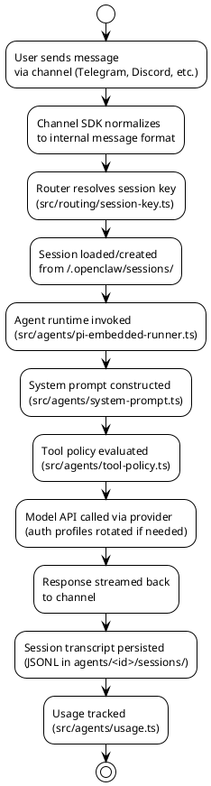
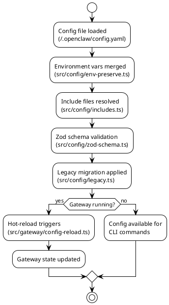
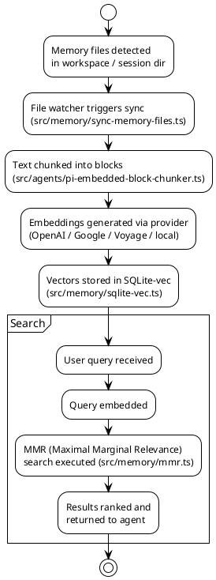
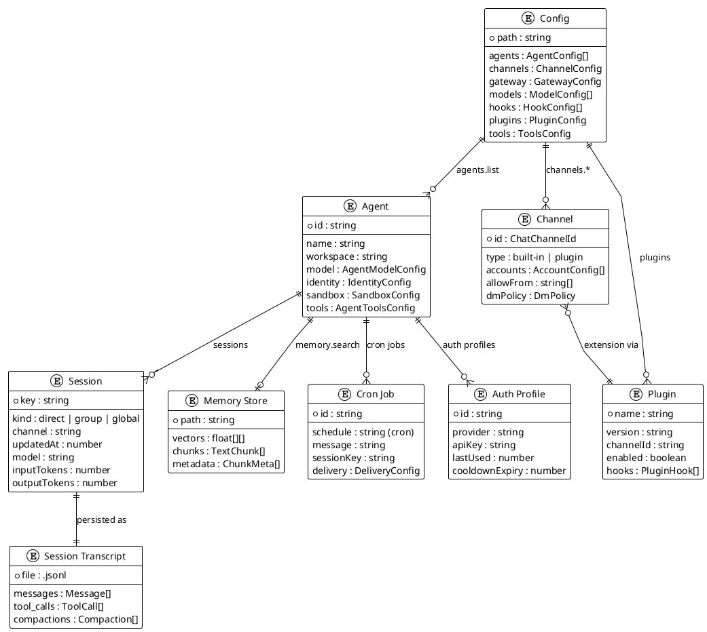

# Data Models & Schemas

## 1. Document Control

| Field   | Value                         |
| ------- | ----------------------------- |
| Version | 1.0                           |
| Date    | 2026-02-17                    |
| Author  | AI Architect (auto-generated) |
| Status  | Draft                         |

---

## 2. Storage Overview

| Store           | Type                | Location                                   | Source File(s)                                 |
| --------------- | ------------------- | ------------------------------------------ | ---------------------------------------------- |
| Configuration   | YAML file           | `~/.openclaw/config.yaml`                  | src/config/io.ts, src/config/config.ts         |
| Credentials     | File-based          | `~/.openclaw/credentials/`                 | src/agents/cli-credentials.ts                  |
| Sessions        | File/JSONL          | `~/.openclaw/sessions/`                    | src/sessions/, src/gateway/session-utils.ts    |
| Agent State     | Directory           | `~/.openclaw/agents/<id>/`                 | src/config/agent-dirs.ts                       |
| Agent Sessions  | JSONL               | `~/.openclaw/agents/<id>/sessions/*.jsonl` | src/agents/pi-embedded-runner.ts               |
| Auth Profiles   | JSON                | `~/.openclaw/agents/<id>/auth.json`        | src/agents/auth-profiles.ts                    |
| Vector Memory   | SQLite (sqlite-vec) | Agent-scoped DB files                      | src/memory/sqlite.ts, src/memory/sqlite-vec.ts |
| Plugin State    | Directory           | `~/.openclaw/plugins/`                     | src/plugins/installs.ts                        |
| Skills          | Directory           | `~/.openclaw/skills/`                      | src/agents/skills/                             |
| Hooks           | TS/JS files         | Workspace or config dir                    | src/hooks/                                     |
| Cron Jobs       | JSON                | Gateway runtime state                      | src/cron/                                      |
| Device Pairing  | File-based          | `~/.openclaw/`                             | src/infra/device-pairing.ts                    |
| Node Pairing    | File-based          | `~/.openclaw/`                             | src/infra/node-pairing.ts                      |
| Build Info      | JSON                | `dist/build-info.json`                     | scripts/write-build-info.ts                    |
| Protocol Schema | JSON                | `dist/protocol.schema.json`                | scripts/protocol-gen.ts                        |

---

## 3. Core Data Models

### 3.1 Configuration (OpenClawConfig)

The main configuration model is defined across `src/config/types.*.ts` files and validated with both TypeBox (`src/config/schema.ts`) and Zod (`src/config/zod-schema.ts`).

**Key type fragments:**

```
src/config/types.ts          — re-exports all config types
src/config/types.base.ts     — base primitives (ReplyMode, SessionScope, DmPolicy, etc.)
src/config/types.agents.ts   — AgentConfig, AgentsConfig, AgentBinding
src/config/types.auth.ts     — auth/credential types
src/config/types.channels.ts — channel config types
src/config/types.discord.ts  — Discord-specific config
src/config/types.gateway.ts  — gateway server config
src/config/types.hooks.ts    — hooks config
src/config/types.memory.ts   — memory/embedding config
src/config/types.models.ts   — model/provider config
src/config/types.plugins.ts  — plugin config
src/config/types.sandbox.ts  — sandbox/Docker config
src/config/types.signal.ts   — Signal config
src/config/types.skills.ts   — skills config
src/config/types.slack.ts    — Slack config
src/config/types.telegram.ts — Telegram config
src/config/types.tools.ts    — tool policy config
src/config/types.tts.ts      — TTS config
src/config/types.whatsapp.ts — WhatsApp config
```

### 3.2 Agent Configuration

```typescript
// Source: src/config/types.agents.ts
type AgentConfig = {
  id: string;
  default?: boolean;
  name?: string;
  workspace?: string;
  agentDir?: string;
  model?: AgentModelConfig;
  skills?: string[];
  memorySearch?: MemorySearchConfig;
  humanDelay?: HumanDelayConfig;
  heartbeat?: AgentDefaultsConfig["heartbeat"];
  identity?: IdentityConfig;
  groupChat?: GroupChatConfig;
  subagents?: {
    allowAgents?: string[];
    model?: string | { primary?: string; fallbacks?: string[] };
  };
  sandbox?: {
    mode?: "off" | "non-main" | "all";
    workspaceAccess?: "none" | "ro" | "rw";
    sessionToolsVisibility?: "spawned" | "all";
    scope?: "session" | "agent" | "shared";
    perSession?: boolean;
    workspaceRoot?: string;
    docker?: SandboxDockerSettings;
    browser?: SandboxBrowserSettings;
    prune?: SandboxPruneSettings;
  };
  tools?: AgentToolsConfig;
};
```

### 3.3 Gateway Session

```typescript
// Source: src/gateway/session-utils.types.ts
type GatewaySessionRow = {
  key: string;
  kind: "direct" | "group" | "global" | "unknown";
  label?: string;
  displayName?: string;
  derivedTitle?: string;
  lastMessagePreview?: string;
  channel?: string;
  subject?: string;
  groupChannel?: string;
  space?: string;
  chatType?: ChatType;
  origin?: SessionEntry["origin"];
  updatedAt: number | null;
  sessionId?: string;
  systemSent?: boolean;
  abortedLastRun?: boolean;
  thinkingLevel?: string;
  verboseLevel?: string;
  reasoningLevel?: string;
  elevatedLevel?: string;
  sendPolicy?: "allow" | "deny";
  inputTokens?: number;
  outputTokens?: number;
  totalTokens?: number;
  totalTokensFresh?: boolean;
  responseUsage?: "on" | "off" | "tokens" | "full";
  modelProvider?: string;
  model?: string;
  contextTokens?: number;
  deliveryContext?: DeliveryContext;
  lastChannel?: SessionEntry["lastChannel"];
  lastTo?: string;
  lastAccountId?: string;
};
```

### 3.4 Gateway Agent

```typescript
// Source: src/gateway/session-utils.types.ts
type GatewayAgentRow = {
  id: string;
  name?: string;
  identity?: {
    name?: string;
    theme?: string;
    emoji?: string;
    avatar?: string;
    avatarUrl?: string;
  };
};
```

### 3.5 Memory Search Result

```typescript
// Source: src/memory/types.ts
type MemorySearchResult = {
  path: string;
  startLine: number;
  endLine: number;
  score: number;
  snippet: string;
  source: MemorySource;
  citation?: string;
};
```

### 3.6 Security Audit Report

```typescript
// Source: src/security/audit.ts
type SecurityAuditFinding = {
  checkId: string;
  severity: SecurityAuditSeverity; // "info" | "warn" | "critical"
  title: string;
  detail: string;
  remediation?: string;
};

type SecurityAuditReport = {
  ts: number;
  summary: SecurityAuditSummary;
  findings: SecurityAuditFinding[];
  deep?: {
    gateway?: {
      attempted: boolean;
      url: string | null;
      ok: boolean;
      error: string | null;
      close?: { code: number; reason: string } | null;
    };
  };
};
```

---

## 4. Schema Validation Systems

OpenClaw uses **two** schema validation systems:

| System  | Library           | Usage                                         | Source Files                                            |
| ------- | ----------------- | --------------------------------------------- | ------------------------------------------------------- |
| TypeBox | @sinclair/typebox | Protocol schemas, tool schemas, config schema | src/gateway/protocol/schema/\*.ts, src/config/schema.ts |
| Zod     | zod               | Config validation, agent model schemas        | src/config/zod-schema.\*.ts                             |

### 4.1 TypeBox Protocol Schemas

Located in `src/gateway/protocol/schema/`:

| Module                    | Schemas Defined                                    |
| ------------------------- | -------------------------------------------------- |
| `primitives.ts`           | Basic types (strings, numbers, enums)              |
| `frames.ts`               | WebSocket frame structure (request/response/event) |
| `agent.ts`                | Agent execution request/response                   |
| `agents-models-skills.ts` | Agents CRUD, model listing, skills operations      |
| `channels.ts`             | Channel status, logout                             |
| `config.ts`               | Config get/set/apply/patch                         |
| `cron.ts`                 | Cron CRUD operations                               |
| `devices.ts`              | Device pairing operations                          |
| `exec-approvals.ts`       | Execution approval workflow                        |
| `logs-chat.ts`            | Log tailing, chat history                          |
| `mesh.ts`                 | Mesh planning/execution                            |
| `nodes.ts`                | Node pairing, invocation                           |
| `sessions.ts`             | Session list/preview/patch/delete/compact          |
| `snapshot.ts`             | Gateway state snapshot                             |
| `wizard.ts`               | Config wizard flow                                 |
| `error-codes.ts`          | Protocol error codes                               |

### 4.2 Zod Config Schemas

Located in `src/config/zod-schema.*.ts`:

| File                               | Schemas Defined                          |
| ---------------------------------- | ---------------------------------------- |
| `zod-schema.ts`                    | Root config schema                       |
| `zod-schema.core.ts`               | Core config (identity, session, routing) |
| `zod-schema.agents.ts`             | Agent configuration                      |
| `zod-schema.agent-defaults.ts`     | Agent default settings                   |
| `zod-schema.agent-model.ts`        | Model configuration per agent            |
| `zod-schema.agent-runtime.ts`      | Agent runtime settings                   |
| `zod-schema.channels.ts`           | Channel settings                         |
| `zod-schema.providers.ts`          | Provider configuration                   |
| `zod-schema.providers-core.ts`     | Core provider settings                   |
| `zod-schema.providers-whatsapp.ts` | WhatsApp-specific provider settings      |
| `zod-schema.hooks.ts`              | Hook configuration                       |
| `zod-schema.approvals.ts`          | Execution approval config                |
| `zod-schema.allowdeny.ts`          | Allow/deny list schemas                  |
| `zod-schema.session.ts`            | Session configuration                    |
| `zod-schema.sensitive.ts`          | Sensitive/secret field handling          |

---

## 5. Data Flow Diagrams

### 5.1 Message Processing Data Flow



### 5.2 Configuration Data Flow



### 5.3 Memory / Embedding Data Flow



---

## 6. Entity-Relationship Diagram



---

## 7. File-System Data Layout

```
~/.openclaw/
├── config.yaml                  # Main configuration file
├── credentials/                 # Provider API keys and tokens
│   ├── anthropic.json
│   ├── openai.json
│   ├── google.json
│   └── ...
├── sessions/                    # Legacy session state
├── agents/
│   ├── default/                 # Default agent
│   │   ├── auth.json            # Auth profile rotation state
│   │   ├── sessions/
│   │   │   ├── <key>.jsonl      # Session transcripts (JSON Lines)
│   │   │   └── <key>.jsonl.reset.* # Reset-path transcripts
│   │   ├── memory/
│   │   │   └── *.db             # SQLite-vec memory databases
│   │   └── skills/              # Installed skills
│   └── <agent-id>/              # Per-agent state directories
├── plugins/                     # Installed plugins
│   └── <plugin-name>/
│       └── node_modules/
├── skills/                      # Shared skills
└── state/                       # Runtime state (locks, pids)
```

---

## References

- [src/config/types.ts](../../src/config/types.ts) — Config type re-exports
- [src/config/types.agents.ts](../../src/config/types.agents.ts) — Agent config types
- [src/config/types.base.ts](../../src/config/types.base.ts) — Base config primitives
- [src/config/schema.ts](../../src/config/schema.ts) — TypeBox config schema
- [src/config/zod-schema.ts](../../src/config/zod-schema.ts) — Zod config schema
- [src/config/io.ts](../../src/config/io.ts) — Config read/write
- [src/gateway/session-utils.types.ts](../../src/gateway/session-utils.types.ts) — Session data types
- [src/gateway/protocol/schema/](../../src/gateway/protocol/schema/) — Protocol schemas
- [src/memory/types.ts](../../src/memory/types.ts) — Memory search types
- [src/memory/sqlite-vec.ts](../../src/memory/sqlite-vec.ts) — SQLite vector storage
- [src/security/audit.ts](../../src/security/audit.ts) — Security audit types

## Appendix

### A. Session Key Format

Session keys follow the pattern `<channel>:<scope>:<identifier>`, resolved in `src/routing/session-key.ts`. Examples:

- `telegram:dm:12345` — Telegram DM with user 12345
- `discord:group:guild-channel` — Discord group channel
- `web:global:default` — Web chat global session

### B. Configuration File Format

The config file (`~/.openclaw/config.yaml`) supports:

- **Include directives** — `includes: ["path/to/override.yaml"]`
- **Environment variable substitution** — `${ENV_VAR}` syntax
- **Legacy migration** — Automatic upgrade of old config formats via `src/config/legacy.ts`
