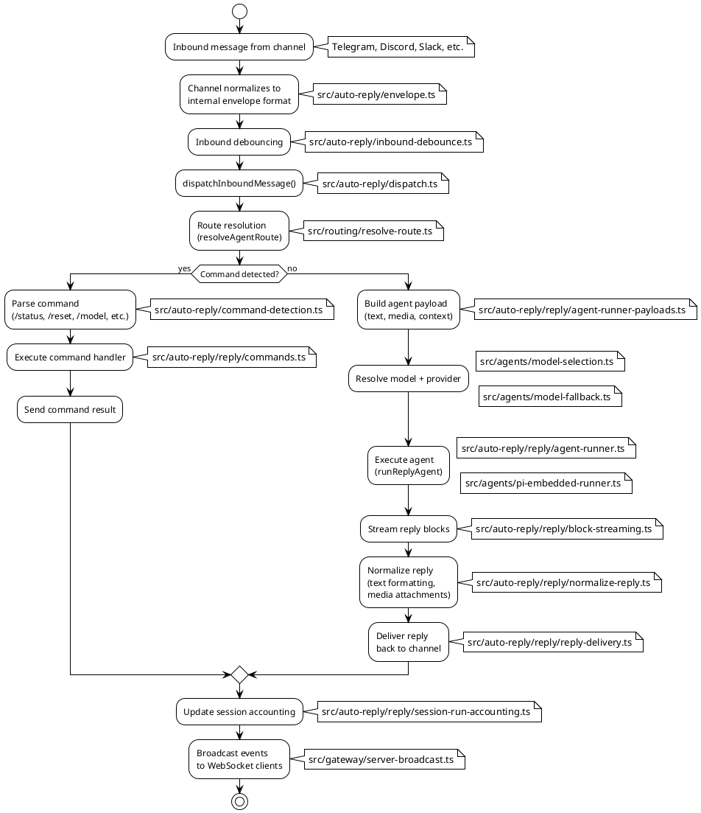
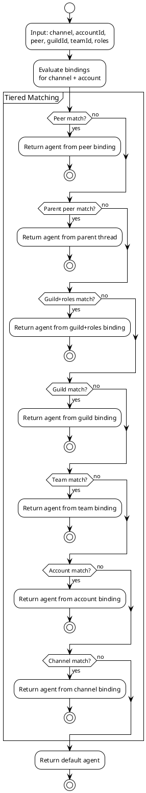
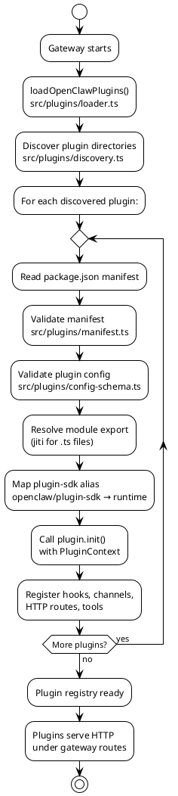

# Business Logic & Context

## 1. Document Control

| Field   | Value                         |
| ------- | ----------------------------- |
| Version | 1.0                           |
| Date    | 2026-02-17                    |
| Author  | AI Architect (auto-generated) |
| Status  | Draft                         |

---

## 2. Feature Inventory

| Feature                 | Module Path                                     | Description                                                     |
| ----------------------- | ----------------------------------------------- | --------------------------------------------------------------- |
| Multi-channel messaging | `src/channels/`, `src/routing/`                 | Routes messages across 15+ channels (Telegram, Discord, etc.)   |
| Agent runtime           | `src/agents/`                                   | Executes AI agents with tool use, session memory, compaction    |
| Auto-reply pipeline     | `src/auto-reply/`                               | Processes inbound messages, dispatches to agents, returns reply |
| Plugin/extension system | `src/plugins/`, `extensions/`                   | Extensible architecture: 40+ extension packages                 |
| Gateway server          | `src/gateway/`                                  | HTTP + WebSocket RPC server (95 methods, 19 events)             |
| Security audit          | `src/security/`                                 | 17 security finding collectors, dangerous tool policy           |
| Hook system             | `src/hooks/`, `src/gateway/hooks.ts`            | Webhook endpoints for external triggers (HTTP, cron, wake)      |
| Cron scheduling         | `src/cron/`, `src/gateway/server-cron.ts`       | Time-based agent invocations                                    |
| Model management        | `src/agents/model-catalog.ts`                   | Model discovery, selection, failover, provider rotation         |
| Session management      | `src/sessions/`, `src/gateway/session-utils.ts` | Session persistence, compaction, identity linking               |
| Vector memory           | `src/memory/`                                   | Embedding generation, SQLite-vec storage, hybrid search (MMR)   |
| Media pipeline          | `src/media/`                                    | Media fetch, store, image ops, audio processing, TTS            |
| Device pairing          | `src/pairing/`                                  | Multi-device pairing (macOS, iOS, Android)                      |
| CLI                     | `src/cli/`, `src/commands/`                     | Commander-based CLI: gateway, agent, config, onboarding         |
| Onboarding              | `src/commands/onboard*.ts`                      | Interactive setup wizard (channels, auth, hooks, skills)        |
| Diagnostics             | `src/commands/doctor*.ts`                       | System health checks and automated repair                       |
| Sandbox execution       | `src/agents/sandbox/`                           | Docker/Podman container sandbox for tool execution              |
| Sub-agent orchestration | `src/agents/subagent-*.ts`                      | Spawning subordinate agents for parallel task execution         |
| Service discovery       | `src/infra/bonjour*.ts`                         | mDNS/Bonjour for LAN gateway discovery                          |
| Browser automation      | `src/browser/`                                  | Playwright-based web browsing tool                              |
| Text-to-speech          | `src/tts/`                                      | Voice synthesis via edge-tts                                    |
| Canvas (A2UI)           | `src/canvas-host/`                              | Artifact rendering UI (HTML/React canvas)                       |
| Control UI              | `ui/`                                           | Web-based control panel (Lit components)                        |
| Native apps             | `apps/`                                         | macOS (SwiftUI), iOS (SwiftUI), Android (Kotlin)                |

---

## 3. Core Business Flows

### 3.1 Message Processing Pipeline

The message processing pipeline is the central business flow — it transforms an inbound channel message into an AI-generated reply.

### 3.2 Agent Route Resolution

The routing system determines which agent handles a message based on channel, account, peer (thread/group), guild, team, and role bindings. The system uses a tiered matching strategy:

**Matching Tiers (priority order):**

1. **Peer binding** — Direct match on thread/group peer ID
2. **Parent peer binding** — Match on parent thread (thread inheritance)
3. **Guild + roles binding** — Discord guild with role-based routing
4. **Guild binding** — Discord guild only
5. **Team binding** — Slack team/workspace
6. **Account binding** — Specific account pattern
7. **Channel binding** — Fallback: wildcard account (`*`)
8. **Default** — Fall back to default agent

Source: `resolveAgentRoute()` in `src/routing/resolve-route.ts`

### 3.3 Plugin Loading & Lifecycle

Extensions are discovered, loaded, and integrated at gateway startup.

**Plugin Loading Flow:**

1. **Discovery** — Scan `extensions/` and configured plugin directories (`src/plugins/discovery.ts`)
2. **Manifest parsing** — Read `package.json`, validate manifest shape (`src/plugins/manifest.ts`)
3. **Config validation** — Validate plugin-specific configuration (`src/plugins/config-schema.ts`)
4. **Module resolution** — Resolve entrypoint via jiti (for TypeScript sources) (`src/plugins/loader.ts`)
5. **Plugin SDK alias** — Map `openclaw/plugin-sdk` imports to runtime resolve (`resolvePluginSdkAlias`)
6. **Registration** — Register plugin hooks, channels, HTTP routes, tools (`src/plugins/registry.ts`)
7. **HTTP routing** — Mount plugin HTTP handlers under gateway server (`src/plugins/http-registry.ts`)

### 3.4 Hook System (Webhook Triggers)

Hooks allow external systems to trigger agent invocations via HTTP endpoints. They are configured with frontmatter in hook files.

**Hook Flow:**

1. External HTTP request hits hooks endpoint
2. Token extraction and validation (`extractHookToken`)
3. Config resolution (`resolveHooksConfig`)
4. Channel and agent policy enforcement
5. Session key resolution
6. Agent invocation via the auto-reply pipeline

Source: `src/gateway/hooks.ts`, `src/hooks/`

### 3.5 Cron Scheduling

Cron jobs schedule periodic agent invocations. The gateway maintains a cron service that triggers messages to agents on a schedule.

**Cron Flow:**

1. **Config read** — Cron jobs defined in OpenClaw config
2. **Schedule** — `croner` library manages cron schedules (`src/cron/`)
3. **Trigger** — On tick, cron service invokes `dispatchInboundMessage()` with cron context
4. **Webhook** — Optionally calls external webhook targets (`resolveCronWebhookTarget`)

Source: `buildGatewayCronService()` in `src/gateway/server-cron.ts`

### 3.6 Model Selection & Failover

The model selection system picks an AI model and provider for each agent invocation. It supports:

- **Model catalog** — Dynamic discovery of available models (`src/agents/model-catalog.ts`)
- **Model selection** — Per-agent model configuration, directive overrides (`src/agents/model-selection.ts`)
- **Auth profiles** — Provider API key rotation (`src/agents/auth-profiles.ts`)
- **Failover chains** — Fallback to alternative models when primary fails (`src/agents/model-fallback.ts`)
- **Rate limiting** — Throttle requests per provider

### 3.7 Session Management

Sessions maintain conversation state across interactions.

**Session lifecycle:**

1. **Creation** — Session created on first message (key derived from agent + channel + account + peer)
2. **Persistence** — Session stored as JSONL files under `~/.openclaw/agents/<agentId>/sessions/`
3. **Compaction** — Long sessions are compacted to reduce context size (`src/agents/compaction.ts`)
4. **Identity linking** — Sessions can be linked across channels for unified identity
5. **DM scope** — Configurable session scoping (`main` or `per-channel`)

### 3.8 In-Chat Command System

When an inbound message starts with `/`, the system intercepts it as a command before reaching the agent.

**Command categories (from `src/auto-reply/reply/commands.ts`):**

- Session commands: `/reset`, `/compact`, `/history`, `/session`
- Model directives: `/model`, `/think`, `/verbose`, `/quality`
- Status: `/status`, `/info`, `/usage`
- Control: `/stop`, `/approve`, `/config`, `/set`, `/unset`
- Agent: `/spawn`, `/mesh` (sub-agent operations)
- Media: `/tts`, `/voice`
- Export: `/export` (session export to HTML)
- Plugin commands: dynamically registered by extensions

Source: `src/auto-reply/commands-registry.ts`, `src/auto-reply/reply/commands.ts`

---

## 4. Architectural Decisions

### ADR-001: ESM-Only Module System

- **Context:** The codebase needs a consistent module system for TypeScript with Node.js
- **Decision:** Use ESM (ECMAScript Modules) exclusively with `.js` file extensions in imports
- **Consequences:** All imports must use `.js` extension; `module: "NodeNext"` in tsconfig; no CommonJS support
- **Source:** `tsconfig.json` (`"module": "NodeNext"`, `"moduleResolution": "NodeNext"`)

### ADR-002: Dual Schema Validation (TypeBox + Zod)

- **Context:** Protocol schemas need JSON Schema compatibility; config schemas need runtime validation
- **Decision:** Use TypeBox for WebSocket RPC protocol schemas (generates JSON Schema) and Zod for config file validation
- **Consequences:** Two schema systems to maintain; TypeBox for wire protocol, Zod for config
- **Source:** `src/gateway/protocol/schema/` (TypeBox), `src/config/zod-schema*.ts` (Zod)

### ADR-003: Dependency Injection via `createDefaultDeps`

- **Context:** CLI commands need testable service dependencies
- **Decision:** Use factory pattern (`createDefaultDeps()`) for dependency injection in CLI commands
- **Consequences:** All commands receive deps as parameter; easy to mock in tests
- **Source:** `src/cli/deps.ts`, used throughout `src/commands/`

### ADR-004: Plugin SDK via Alias Resolution

- **Context:** Plugins need to import from `openclaw/plugin-sdk` but can't use workspace protocol in production
- **Decision:** Resolve `openclaw/plugin-sdk` at runtime via jiti alias mapping
- **Consequences:** Plugins declare `openclaw` in `devDependencies`/`peerDependencies`; runtime resolves via alias
- **Source:** `src/plugins/loader.ts` (`resolvePluginSdkAlias`)

### ADR-005: No Prototype Mutation

- **Context:** Shared class behavior needed across modules
- **Decision:** Never share class behavior via prototype mutation; use explicit inheritance/composition
- **Consequences:** Stronger TypeScript type checking; no `applyPrototypeMixins` or `Object.defineProperty` on prototypes
- **Source:** `AGENTS.md` (coding style guidelines)

### ADR-006: No `Type.Union` in Tool Schemas

- **Context:** Some AI providers (google-antigravity) reject `anyOf`/`oneOf`/`allOf` in tool input schemas
- **Decision:** Avoid `Type.Union` in tool schemas; use `stringEnum`/`optionalStringEnum` for string lists, `Type.Optional` instead of nullable
- **Consequences:** Tool schemas must be flat objects with simple types
- **Source:** `AGENTS.md` (tool schema guardrails)

### ADR-007: Channel Plugin Architecture

- **Context:** Need to support 15+ messaging channels without monolithic codebase
- **Decision:** Core channels in `src/<channel>/`; additional channels as plugin extensions in `extensions/`
- **Consequences:** Core: Telegram, Discord, Slack, Signal, WhatsApp, iMessage, Web; Extensions: Matrix, MS Teams, IRC, Nostr, Feishu, Zalo, etc.
- **Source:** `src/channels/`, `extensions/`

### ADR-008: Colocated Test Files

- **Context:** Test discoverability and maintenance
- **Decision:** Test files colocated with source using `*.test.ts` naming pattern
- **Consequences:** Tests live next to source; Vitest discovers them via glob patterns
- **Source:** `vitest.config.ts`, project-wide test file patterns

### ADR-009: CLI Color Palette

- **Context:** Terminal output needs consistent theming
- **Decision:** Use shared CLI palette from `src/terminal/palette.ts`; no hardcoded colors
- **Consequences:** All terminal UI uses palette; consistent look across CLI output
- **Source:** `src/terminal/palette.ts`, `AGENTS.md` (Lobster seam)

---

## 5. Configuration Reference

### Core Configuration Keys

| Key                     | Default     | Type     | Description                                | Source                         |
| ----------------------- | ----------- | -------- | ------------------------------------------ | ------------------------------ |
| `gateway.mode`          | `local`     | string   | Gateway run mode (local/remote)            | `src/config/`                  |
| `gateway.port`          | `18789`     | number   | HTTP server port                           | `src/gateway/server.impl.ts`   |
| `gateway.bind`          | `loopback`  | string   | Host binding (loopback/all)                | `src/gateway/`                 |
| `agents`                | `{}`        | object[] | Agent definitions (model, tools, identity) | `src/config/types*.ts`         |
| `channels`              | `{}`        | object   | Channel configurations (tokens, etc.)      | `src/config/types*.ts`         |
| `session.dmScope`       | `main`      | string   | DM session scoping mode                    | `src/routing/resolve-route.ts` |
| `session.identityLinks` | `undefined` | object[] | Cross-channel identity linking             | `src/routing/resolve-route.ts` |
| `hooks`                 | `undefined` | object   | Webhook hook configuration                 | `src/hooks/`                   |
| `cron`                  | `undefined` | object[] | Cron job definitions                       | `src/gateway/server-cron.ts`   |
| `plugins`               | `[]`        | string[] | Plugin package paths                       | `src/plugins/`                 |
| `security`              | `{}`        | object   | Security policy overrides                  | `src/security/`                |
| `memory`                | `undefined` | object   | Vector memory configuration                | `src/memory/`                  |
| `media`                 | `undefined` | object   | Media pipeline configuration               | `src/media/`                   |
| `tts`                   | `undefined` | object   | Text-to-speech configuration               | `src/tts/`                     |
| `sandbox`               | `undefined` | object   | Sandbox configuration (docker/podman)      | `src/agents/sandbox/`          |

### Agent Configuration Keys

| Key                     | Type     | Description                    |
| ----------------------- | -------- | ------------------------------ |
| `agents[].id`           | string   | Agent identifier               |
| `agents[].model`        | string   | Default AI model               |
| `agents[].provider`     | string   | AI provider                    |
| `agents[].systemPrompt` | string   | Custom system prompt           |
| `agents[].tools`        | object   | Tool policy (allow/deny lists) |
| `agents[].sandbox`      | object   | Sandbox config for this agent  |
| `agents[].identity`     | object   | Agent name, personality        |
| `agents[].subagents`    | object[] | Sub-agent configuration        |
| `agents[].bindings`     | object[] | Channel-to-agent bindings      |

### Environment Variables

| Variable             | Purpose                              |
| -------------------- | ------------------------------------ |
| `NODE_ENV`           | Environment (production/development) |
| `OPENCLAW_HOME`      | Override config directory            |
| `OPENCLAW_LOG_LEVEL` | Logging verbosity                    |
| `OPENCLAW_BIND`      | Gateway bind address override        |
| `OPENCLAW_PORT`      | Gateway port override                |

---

## References

- [src/routing/resolve-route.ts](../../src/routing/resolve-route.ts) — Route resolution logic
- [src/auto-reply/dispatch.ts](../../src/auto-reply/dispatch.ts) — Inbound message dispatch
- [src/auto-reply/reply/](../../src/auto-reply/reply/) — Reply pipeline (100+ files)
- [src/agents/pi-embedded-runner.ts](../../src/agents/pi-embedded-runner.ts) — Agent execution
- [src/plugins/loader.ts](../../src/plugins/loader.ts) — Plugin loading
- [src/gateway/hooks.ts](../../src/gateway/hooks.ts) — Hook system
- [src/gateway/server-cron.ts](../../src/gateway/server-cron.ts) — Cron scheduling
- [src/agents/model-catalog.ts](../../src/agents/model-catalog.ts) — Model catalog
- [src/agents/model-fallback.ts](../../src/agents/model-fallback.ts) — Model failover
- [src/config/](../../src/config/) — Configuration system
- [AGENTS.md](../../AGENTS.md) — Repository guidelines (architectural decisions)

## Appendix

### A. Supported Channels (Complete List)

**Core (built-in):**

1. Telegram (`src/telegram/`)
2. Discord (`src/discord/`)
3. Slack (`src/slack/`)
4. Signal (`src/signal/`)
5. WhatsApp (`src/whatsapp/`, `src/web/`)
6. iMessage (`src/imessage/`)
7. Line (`src/line/`)
8. WebChat (`src/channels/web/`)

**Extensions (plugin-based):**

1. Matrix (`extensions/matrix/`)
2. Microsoft Teams (`extensions/msteams/`)
3. IRC (`extensions/irc/`)
4. Nostr (`extensions/nostr/`)
5. Feishu/Lark (`extensions/feishu/`)
6. Google Chat (`extensions/googlechat/`)
7. Mattermost (`extensions/mattermost/`)
8. Nextcloud Talk (`extensions/nextcloud-talk/`)
9. Twitch (`extensions/twitch/`)
10. Tlon (`extensions/tlon/`)
11. Zalo OA (`extensions/zalo/`)
12. Zalo User (`extensions/zalouser/`)
13. BlueBubbles (`extensions/bluebubbles/`)
14. Voice Call (`extensions/voice-call/`)

### B. Auto-Reply Module Decomposition

The `src/auto-reply/` directory is one of the largest modules (~100 files) covering the full inbound-to-reply pipeline:

| Sub-module                    | Purpose                                        |
| ----------------------------- | ---------------------------------------------- |
| `envelope.ts`                 | Message envelope normalization                 |
| `dispatch.ts`                 | Message dispatch to reply pipeline             |
| `command-detection.ts`        | `/command` detection and parsing               |
| `commands-registry.ts`        | Registry of available slash commands           |
| `heartbeat.ts`                | Typing indicator / heartbeat handling          |
| `inbound-debounce.ts`         | Message deduplication/debouncing               |
| `model.ts`                    | Inbound message model                          |
| `thinking.ts`                 | Thinking/reasoning mode control                |
| `reply/agent-runner.ts`       | Core agent execution for replies               |
| `reply/commands.ts`           | Command handler implementations                |
| `reply/directive-handling.ts` | Model/thinking directive parsing & application |
| `reply/get-reply.ts`          | Top-level reply orchestration                  |
| `reply/reply-delivery.ts`     | Reply delivery to channel                      |
| `reply/block-streaming.ts`    | Block-level streaming of agent output          |
| `reply/queue.ts`              | Reply queue management                         |
| `reply/session.ts`            | Session state management during reply          |
