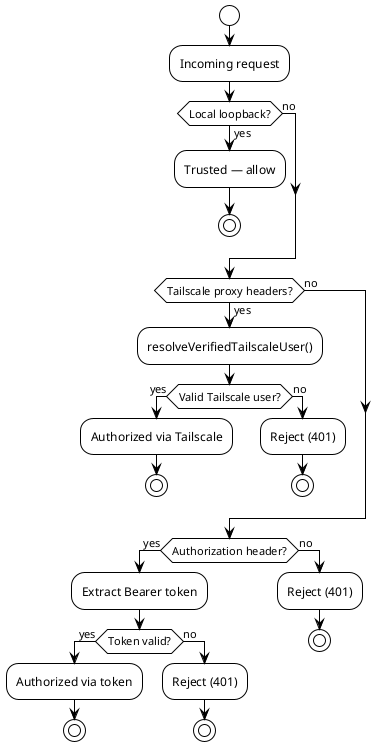
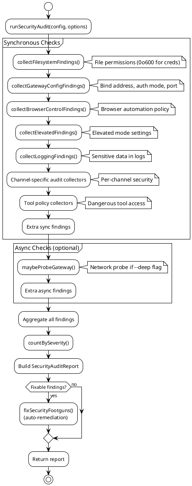

# Security & Compliance Rules

## 1. Document Control

| Field   | Value                         |
| ------- | ----------------------------- |
| Version | 1.0                           |
| Date    | 2026-02-17                    |
| Author  | AI Architect (auto-generated) |
| Status  | Draft                         |

---

## 2. Authentication & Authorization

### Gateway Authentication Modes

The gateway server supports multiple authentication modes for both HTTP and WebSocket connections.

| Mechanism        | Scope              | Implementation                                | Source File           |
| ---------------- | ------------------ | --------------------------------------------- | --------------------- |
| Local direct     | Gateway (loopback) | Requests from loopback are trusted by default | `src/gateway/auth.ts` |
| Bearer token     | Gateway API        | HTTP `Authorization: Bearer <token>` header   | `src/gateway/auth.ts` |
| Tailscale proxy  | Gateway (remote)   | Tailscale whois lookup via proxy headers      | `src/gateway/auth.ts` |
| Per-channel auth | Channel-specific   | Each channel has its own token/credential     | `src/<channel>/`      |
| Plugin auth      | Extension channels | Plugin-provided auth handler                  | `extensions/*/`       |

### Key Functions

| Function                         | Purpose                                | Source                |
| -------------------------------- | -------------------------------------- | --------------------- |
| `resolveGatewayAuth()`           | Determine auth mode for the gateway    | `src/gateway/auth.ts` |
| `authorizeGatewayConnect()`      | Authorize WebSocket connection attempt | `src/gateway/auth.ts` |
| `authorizeTrustedProxy()`        | Validate trusted proxy (Tailscale)     | `src/gateway/auth.ts` |
| `isLocalDirectRequest()`         | Check if request is from loopback      | `src/gateway/auth.ts` |
| `resolveVerifiedTailscaleUser()` | Verify user via Tailscale whois        | `src/gateway/auth.ts` |
| `assertGatewayAuthConfigured()`  | Fail if auth is not properly set up    | `src/gateway/auth.ts` |

### Authentication Flow



---

## 3. Security Audit Pipeline

The security audit system (`runSecurityAudit()`) runs a comprehensive battery of checks and produces a structured report.

### Audit Finding Categories

The audit system has **17 finding collectors** organized by category:

| Collector                         | Category         | What It Checks                                     |
| --------------------------------- | ---------------- | -------------------------------------------------- |
| `collectFilesystemFindings()`     | File permissions | Config/credential files with excessive permissions |
| `collectGatewayConfigFindings()`  | Gateway config   | Open bindings, missing auth, exposed ports         |
| `collectBrowserControlFindings()` | Browser          | Browser automation security settings               |
| `collectElevatedFindings()`       | Elevated mode    | Elevated permissions and override risks            |
| `collectLoggingFindings()`        | Logging          | Sensitive data in log output                       |
| Channel audit collectors          | Channel-specific | Per-channel security checks                        |
| Tool policy collectors            | Tool policy      | Dangerous tool access, sandbox requirements        |
| Extra sync collectors             | Miscellaneous    | Additional synchronous security checks             |
| Extra async collectors            | Miscellaneous    | Additional async security checks (network probes)  |

Source: `src/security/audit.ts`

### Audit Report Structure

```typescript
interface SecurityAuditReport {
  findings: SecurityAuditFinding[];
  summary: SecurityAuditSummary;
}

interface SecurityAuditFinding {
  id: string; // Unique finding identifier
  severity: SecurityAuditSeverity; // "critical" | "high" | "medium" | "low" | "info"
  category: string; // Finding category
  title: string; // Human-readable title
  description: string; // Detailed description
  fix?: string; // Remediation guidance
  fixAction?: SecurityFixAction; // Automated fix action
}

interface SecurityAuditSummary {
  total: number;
  critical: number;
  high: number;
  medium: number;
  low: number;
  info: number;
}
```

### Audit Flow



---

## 4. Tool Policy & Dangerous Tools

### Dangerous Tool Classification

The system classifies certain tools as dangerous and enforces policy controls.

| Constant                         | Description                            | Source                            |
| -------------------------------- | -------------------------------------- | --------------------------------- |
| `DANGEROUS_ACP_TOOLS`            | Set of dangerous ACP tool names        | `src/security/dangerous-tools.ts` |
| `DANGEROUS_ACP_TOOL_NAMES`       | Names of dangerous ACP tools           | `src/security/dangerous-tools.ts` |
| `DEFAULT_GATEWAY_HTTP_TOOL_DENY` | Default deny list for HTTP tool access | `src/security/dangerous-tools.ts` |

### Tool Policy Enforcement

Tool access is controlled at the agent level via per-agent `tools` configuration:

```yaml
agents:
  - id: main
    tools:
      allow: ["browser", "memory"] # Explicit allowlist
      deny: ["bash", "exec"] # Explicit denylist
      sandbox: required # Require sandbox for exec tools
```

The `tool-policy.ts` module (`src/agents/tool-policy.ts`) evaluates whether a tool should be permitted for each agent invocation.

### Exec Approval Workflow

When an agent wants to execute a bash command or dangerous tool:

1. Tool invocation request is generated by the agent
2. Policy check determines if tool is allowed, denied, or requires approval
3. If approval required: UI prompt shown to user (CLI/app)
4. If approved: tool executes (optionally in sandbox)
5. If denied: tool returns error to agent

---

## 5. External Content Sanitization

External content (web pages, hook payloads, user uploads) is sanitized before being included in agent prompts.

| Function                     | Purpose                                   | Source                             |
| ---------------------------- | ----------------------------------------- | ---------------------------------- |
| `wrapExternalContent()`      | Wrap external text with safety markers    | `src/security/external-content.ts` |
| `wrapWebContent()`           | Wrap web-fetched content                  | `src/security/external-content.ts` |
| `buildSafeExternalPrompt()`  | Build sanitized prompt from external data | `src/security/external-content.ts` |
| `detectSuspiciousPatterns()` | Detect prompt injection patterns          | `src/security/external-content.ts` |

External content is wrapped with markers:

- `EXTERNAL_CONTENT_START` / `EXTERNAL_CONTENT_END` — Delimiters around untrusted content
- `EXTERNAL_CONTENT_WARNING` — Safety warning prepended to external content
- `SUSPICIOUS_PATTERNS` — Regex patterns detecting possible prompt injection attempts

---

## 6. Data Handling & Storage Security

### Credential Storage

| Path                             | Purpose            | Permissions     |
| -------------------------------- | ------------------ | --------------- |
| `~/.openclaw/credentials/`       | API keys, tokens   | `0o600` (owner) |
| `~/.openclaw/config.yaml`        | Main configuration | `0o600` (owner) |
| `~/.openclaw/agents/*/sessions/` | Session JSONL logs | `0o600` (owner) |

The security audit checks file permissions and reports findings when credentials are world-readable. The `fixSecurityFootguns()` function automatically remediates permission issues:

| Fix Function                      | Action                                         |
| --------------------------------- | ---------------------------------------------- |
| `safeChmod()`                     | Set correct file permissions                   |
| `safeAclReset()`                  | Reset ACL entries                              |
| `chmodCredentialsAndAgentState()` | Fix permissions on credentials and agent state |
| `applyConfigFixes()`              | Apply configuration-level security fixes       |
| `setGroupPolicyAllowlist()`       | Enforce group-level allowlists                 |

Source: `src/security/fix.ts`

### Windows ACL Support

The system includes Windows-specific ACL handling for credential files:

Source: `src/security/windows-acl.ts`

### Secret Comparison

Constant-time secret comparison (`secret-equal.ts`) for token validation:

Source: `src/security/secret-equal.ts`

---

## 7. Sandbox & Isolation

### Sandbox Containers

OpenClaw supports Docker and Podman for sandboxing tool execution.

| Dockerfile                   | Purpose                      | Base Image             |
| ---------------------------- | ---------------------------- | ---------------------- |
| `Dockerfile.sandbox`         | Base sandbox (CLI tools)     | `debian:bookworm-slim` |
| `Dockerfile.sandbox-common`  | Shared sandbox layers        | (shared base)          |
| `Dockerfile.sandbox-browser` | Sandbox with browser support | (includes playwright)  |

**Sandbox Security Properties:**

- Non-root user (`sandbox` user, created via `useradd`)
- Minimal package set (bash, curl, git, jq, python3, ripgrep)
- Network isolation (configurable)
- Filesystem isolation (bind mounts for workspace only)
- `sleep infinity` as default CMD (container kept alive for tool reuse)

### Sandbox Configuration

```yaml
agents:
  - id: main
    sandbox:
      type: docker # or "podman"
      image: openclaw-sandbox
      network: none # Network isolation
      workspace: /path # Mounted workspace
```

Source: `src/agents/sandbox/`, `Dockerfile.sandbox`

---

## 8. Skill Scanner Security

The skill scanner validates loaded skill files for potential security concerns:

Source: `src/security/skill-scanner.ts`

---

## 9. Threat Model & Security Documentation

### Existing Security Documentation

| Document                     | Path                                         | Coverage                          |
| ---------------------------- | -------------------------------------------- | --------------------------------- |
| Security Policy              | `SECURITY.md`                                | Reporting, contacts, scope        |
| Threat Model Atlas           | `docs/security/THREAT-MODEL-ATLAS.md`        | Comprehensive threat model        |
| Formal Verification          | `docs/security/formal-verification.md`       | Formal verification approaches    |
| Contributing (Threat Model)  | `docs/security/CONTRIBUTING-THREAT-MODEL.md` | How to contribute to threat model |
| Security Documentation Guide | `docs/security/README.md`                    | Overview of security docs         |

### Key Threat Surface Areas

Based on the threat model and code analysis:

1. **Channel authentication** — Each messaging channel has its own auth surface (bot tokens, API keys, session cookies)
2. **Gateway exposure** — HTTP/WebSocket server binding, TLS, proxy trust
3. **Tool execution** — Shell commands, file system access, browser automation
4. **External content** — Prompt injection via web content, webhooks, user uploads
5. **Credential storage** — API keys and tokens at rest
6. **Plugin code** — Third-party extensions running in the same process
7. **Sandbox escape** — Container isolation for tool execution

### Reporting Security Issues

- Private vulnerability reporting via GitHub (preferred)
- Email: security@openclaw.ai
- Required report fields: title, severity, impact, reproduction, remediation
- No bug bounty program
- See `SECURITY.md` for full details

---

## References

- [SECURITY.md](../../SECURITY.md) — Security policy
- [src/security/audit.ts](../../src/security/audit.ts) — Main audit function
- [src/security/dangerous-tools.ts](../../src/security/dangerous-tools.ts) — Dangerous tool classification
- [src/security/external-content.ts](../../src/security/external-content.ts) — Content sanitization
- [src/security/fix.ts](../../src/security/fix.ts) — Security fix application
- [src/security/scan-paths.ts](../../src/security/scan-paths.ts) — Path scanning
- [src/gateway/auth.ts](../../src/gateway/auth.ts) — Gateway authentication
- [src/agents/tool-policy.ts](../../src/agents/tool-policy.ts) — Tool policy enforcement
- [src/agents/sandbox/](../../src/agents/sandbox/) — Sandbox container management
- [Dockerfile.sandbox](../../Dockerfile.sandbox) — Sandbox container image
- [docs/security/THREAT-MODEL-ATLAS.md](../../docs/security/THREAT-MODEL-ATLAS.md) — Threat model

## Appendix

### A. Security Audit Severity Levels

| Severity   | Action Required       | Example                                 |
| ---------- | --------------------- | --------------------------------------- |
| `critical` | Immediate remediation | Credentials world-readable              |
| `high`     | Fix before deployment | Gateway bound to all interfaces         |
| `medium`   | Track and fix         | Missing allowlist on group channel      |
| `low`      | Good practice         | Recommendation for additional hardening |
| `info`     | Informational only    | Configuration detail noted              |

### B. File Permission Policy

| File/Directory                          | Expected Permission | Platform |
| --------------------------------------- | ------------------- | -------- |
| `~/.openclaw/credentials/`              | `0o700`             | Unix     |
| `~/.openclaw/credentials/*`             | `0o600`             | Unix     |
| `~/.openclaw/config.yaml`               | `0o600`             | Unix     |
| `~/.openclaw/agents/*/sessions/*.jsonl` | `0o600`             | Unix     |
| Windows credential files                | ACL: owner-only     | Windows  |
