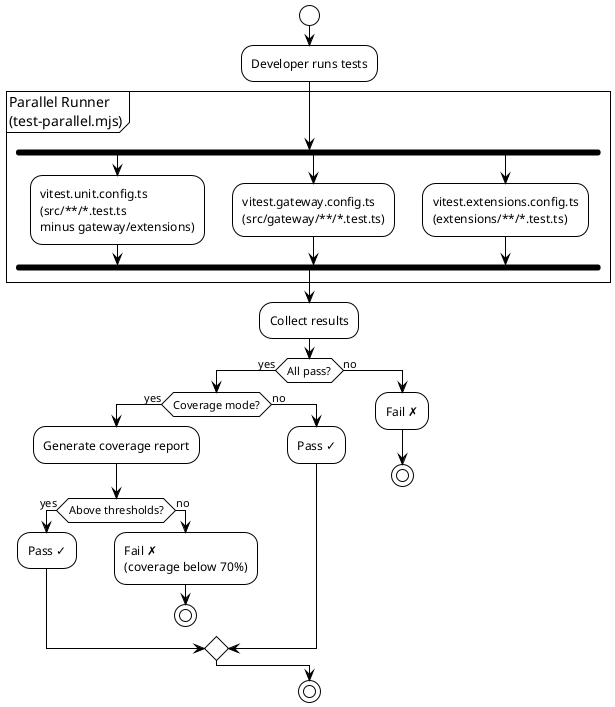

# Testing & Validation Guidelines

## 1. Document Control

| Field   | Value                         |
| ------- | ----------------------------- |
| Version | 1.0                           |
| Date    | 2026-02-17                    |
| Author  | AI Architect (auto-generated) |
| Status  | Draft                         |

---

## 2. Test Architecture

The project uses a multi-config Vitest setup, splitting tests into isolated scopes with distinct runner configurations.

### Configuration Files

| Config File                   | Scope               | Include Pattern                                                    | Pool    | Workers                |
| ----------------------------- | ------------------- | ------------------------------------------------------------------ | ------- | ---------------------- |
| `vitest.config.ts`            | All tests (default) | `src/**/*.test.ts`, `extensions/**/*.test.ts`, `test/**/*.test.ts` | forks   | CI: 3, Local: up to 16 |
| `vitest.unit.config.ts`       | Unit tests only     | Same as base, minus `extensions/` and `src/gateway/`               | forks   | inherited              |
| `vitest.gateway.config.ts`    | Gateway tests       | `src/gateway/**/*.test.ts`                                         | forks   | inherited              |
| `vitest.extensions.config.ts` | Extension tests     | `extensions/**/*.test.ts`                                          | forks   | inherited              |
| `vitest.e2e.config.ts`        | End-to-end tests    | `test/**/*.e2e.test.ts`, `src/**/*.e2e.test.ts`                    | vmForks | CI: 2–4, Local: 4–8    |
| `vitest.live.config.ts`       | Live tests (API)    | `src/**/*.live.test.ts`                                            | forks   | 1 (serial)             |

### Base Configuration Details

From `vitest.config.ts`:

| Setting         | Value                    | Notes                               |
| --------------- | ------------------------ | ----------------------------------- |
| `testTimeout`   | 120,000 ms (2 min)       | Generous for AI model calls         |
| `hookTimeout`   | 120,000 ms (180s on Win) | Extended for Windows CI             |
| `pool`          | `forks`                  | Process-level isolation             |
| `maxWorkers`    | 16 (local), 3 (CI)       | CI: 2 on Windows                    |
| `unstubEnvs`    | `true`                   | Prevent env var leaks between tests |
| `unstubGlobals` | `true`                   | Prevent global leaks between tests  |
| `setupFiles`    | `["test/setup.ts"]`      | Global test setup                   |

### Module Aliases (Test)

```typescript
resolve: {
  alias: [
    { find: "openclaw/plugin-sdk/account-id", replacement: "src/plugin-sdk/account-id.ts" },
    { find: "openclaw/plugin-sdk", replacement: "src/plugin-sdk/index.ts" },
  ],
}
```

---

## 3. Coverage Requirements

| Metric     | Threshold | Notes                                |
| ---------- | --------- | ------------------------------------ |
| Lines      | 70%       | Core `src/` only                     |
| Functions  | 70%       |                                      |
| Branches   | 55%       | Slightly lower for complex branching |
| Statements | 70%       |                                      |

**Coverage Provider:** V8 (`@vitest/coverage-v8`)

**Coverage Scope:** Only files in `./src/**/*.ts` that are exercised by tests (`all: false`).

**Excluded from Coverage:**

| Category              | Paths                                            | Rationale                        |
| --------------------- | ------------------------------------------------ | -------------------------------- |
| Extensions/apps       | `extensions/**`, `apps/**`, `ui/**`              | Separate coverage scope          |
| Test files            | `src/**/*.test.ts`, `test/**`                    | Not production code              |
| Entry points & wiring | `src/entry.ts`, `src/index.ts`, `src/runtime.ts` | Covered by CI smoke tests        |
| CLI & commands        | `src/cli/**`, `src/commands/**`                  | Validated via integration/manual |
| Gateway integration   | `src/gateway/**`                                 | Gateway e2e/manual tests         |
| Agents                | `src/agents/**`                                  | Validated via e2e/manual         |
| Channel surfaces      | `src/discord/**`, `src/slack/**`, etc.           | Integration-tested per channel   |
| Interactive UIs       | `src/tui/**`, `src/wizard/**`                    | Manual validation                |
| Process bridges       | `src/process/exec.ts`, `src/process/tau-rpc.ts`  | Hard to unit-test                |

---

## 4. Test Patterns & Conventions

### 4.1 File Naming

| Pattern              | Purpose              | Example                                |
| -------------------- | -------------------- | -------------------------------------- |
| `*.test.ts`          | Unit tests           | `model-catalog.test.ts`                |
| `*.e2e.test.ts`      | End-to-end tests     | `gateway.e2e.test.ts`                  |
| `*.live.test.ts`     | Live API tests       | `models.profiles.live.test.ts`         |
| `*.test-harness.ts`  | Test harness/helpers | `reply.test-harness.ts`                |
| `*.test-fixtures.ts` | Test fixture data    | `media-understanding.test-fixtures.ts` |

### 4.2 Colocation

Tests are **colocated** with source files. A module `src/security/audit.ts` has its tests at `src/security/audit.test.ts`.

### 4.3 E2E Test Naming Convention

E2E tests in `src/auto-reply/reply/` use descriptive dot-separated names:

```
reply.triggers.trigger-handling.<description>.e2e.test.ts
reply.directive.directive-behavior.<description>.e2e.test.ts
```

### 4.4 Example Unit Test

```typescript
import { describe, it, expect, vi } from "vitest";
import { resolveAgentRoute } from "./resolve-route.js";

describe("resolveAgentRoute", () => {
  it("should resolve default agent when no bindings match", () => {
    const result = resolveAgentRoute({
      cfg: { agents: [{ id: "main" }] },
      channel: "telegram",
      accountId: "12345",
    });
    expect(result.agentId).toBe("main");
    expect(result.matchedBy).toBe("default");
  });

  it("should match peer binding with highest priority", () => {
    const result = resolveAgentRoute({
      cfg: {
        agents: [
          { id: "main" },
          {
            id: "thread-agent",
            bindings: [{ channel: "discord", peer: "thread-123" }],
          },
        ],
      },
      channel: "discord",
      accountId: "user1",
      peer: { kind: "thread", id: "thread-123" },
    });
    expect(result.agentId).toBe("thread-agent");
    expect(result.matchedBy).toBe("binding.peer");
  });
});
```

### 4.5 Test Environment Isolation

- `unstubEnvs: true` — Auto-restore env vars after each test
- `unstubGlobals: true` — Auto-restore globals after each test
- `pool: "forks"` — Process-level isolation between test files
- E2E uses `pool: "vmForks"` for stronger VM-level isolation

### 4.6 Per-Instance Stubs (Not Prototype)

Per AGENTS.md guidelines: prefer per-instance stubs over prototype mutation:

```typescript
// ✅ Correct
const instance = new SomeClass();
vi.spyOn(instance, "method").mockReturnValue("mocked");

// ❌ Avoid
SomeClass.prototype.method = vi.fn();
```

---

## 5. Test Commands Reference

### Standard Commands

| Command                | Description                                     |
| ---------------------- | ----------------------------------------------- |
| `pnpm test`            | Run all tests in parallel (test-parallel.mjs)   |
| `pnpm test:fast`       | Unit tests only (excludes gateway + extensions) |
| `pnpm test:coverage`   | Unit tests with V8 coverage report              |
| `pnpm test:e2e`        | End-to-end tests (vmForks pool)                 |
| `pnpm test:live`       | Live API tests (serial, requires `LIVE=1`)      |
| `pnpm test:gateway`    | Gateway-specific tests                          |
| `pnpm test:extensions` | Extension-specific tests                        |

### Live Test Environment Variables

| Variable               | Purpose                                         |
| ---------------------- | ----------------------------------------------- |
| `CLAWDBOT_LIVE_TEST=1` | Enable live tests (OpenClaw-only)               |
| `LIVE=1`               | Enable all live tests (including provider live) |

### Docker Test Commands

| Command                         | Description                       |
| ------------------------------- | --------------------------------- |
| `pnpm test:docker:live-models`  | Docker-based live model tests     |
| `pnpm test:docker:live-gateway` | Docker-based live gateway tests   |
| `pnpm test:docker:onboard`      | Docker-based onboarding E2E tests |
| `pnpm test:docker:all`          | Run all Docker-based tests        |

### E2E Worker Tuning

E2E worker count is configurable:

- Default: CPU-aware (50% CI, 60% local, capped at 16)
- Override: `OPENCLAW_E2E_WORKERS=<n>`
- Verbose: `OPENCLAW_E2E_VERBOSE=1`

---

## 6. CI/CD Integration

### Pre-Commit Hooks

```bash
# Install pre-commit hooks
prek install
```

The pre-commit hook (`git-hooks/pre-commit`) runs the same checks as CI before each commit:

- Format check (`pnpm format`)
- Type check (`pnpm tsgo`)
- Lint (`pnpm lint`)

### CI Quality Gates

| Gate          | Command                   | Blocking?     | Notes                          |
| ------------- | ------------------------- | ------------- | ------------------------------ |
| Format        | `pnpm format`             | Yes           | Oxfmt check mode               |
| Type check    | `pnpm tsgo`               | Yes           | Native TypeScript type checker |
| Lint          | `pnpm lint`               | Yes           | Oxlint type-aware              |
| Unit tests    | `pnpm test`               | Yes           | Coverage thresholds enforced   |
| E2E tests     | `pnpm test:e2e`           | Yes           | vmForks pool                   |
| Install smoke | `pnpm test:install:smoke` | Yes           | Package installation sanity    |
| Release check | `pnpm release:check`      | Yes (release) | Pre-release validation         |

### CI Worker Limits

- Max workers: **16** (hard cap; higher values have been tried and do not improve performance)
- CI workers: **3** (Linux), **2** (Windows)

---

## 7. Test Execution Flow



---

## References

- [vitest.config.ts](../../vitest.config.ts) — Base Vitest configuration
- [vitest.unit.config.ts](../../vitest.unit.config.ts) — Unit test configuration
- [vitest.e2e.config.ts](../../vitest.e2e.config.ts) — E2E test configuration
- [vitest.live.config.ts](../../vitest.live.config.ts) — Live test configuration
- [vitest.gateway.config.ts](../../vitest.gateway.config.ts) — Gateway test configuration
- [vitest.extensions.config.ts](../../vitest.extensions.config.ts) — Extensions test configuration
- [test/setup.ts](../../test/setup.ts) — Global test setup
- [git-hooks/pre-commit](../../git-hooks/pre-commit) — Pre-commit hook
- [AGENTS.md](../../AGENTS.md) — Testing guidelines
- [docs/testing.md](../../docs/testing.md) — Testing documentation

## Appendix

### A. Test File Statistics

The auto-reply module alone has **50+ test files**, reflecting the extensive test coverage for the message processing pipeline. Test patterns include:

- Standard unit tests (`.test.ts`)
- Behavioral E2E tests (`.e2e.test.ts`) with descriptive scenario names
- Test harnesses (`.test-harness.ts`) for shared test setup
- Test fixture files (`.test-fixtures.ts`) for test data

### B. Vitest Config Inheritance

All specialized configs inherit from `vitest.config.ts`:

```
vitest.config.ts (base)
  ├── vitest.unit.config.ts (excludes gateway + extensions)
  ├── vitest.gateway.config.ts (gateway only)
  ├── vitest.extensions.config.ts (extensions only)
  ├── vitest.e2e.config.ts (e2e only, vmForks pool)
  └── vitest.live.config.ts (live only, serial)
```

### C. Windows Testing Notes

- Hook timeout extended to **180s** on Windows (vs 120s elsewhere)
- CI workers reduced to **2** on Windows
- Windows ACL tests: `src/security/windows-acl.test.ts`
